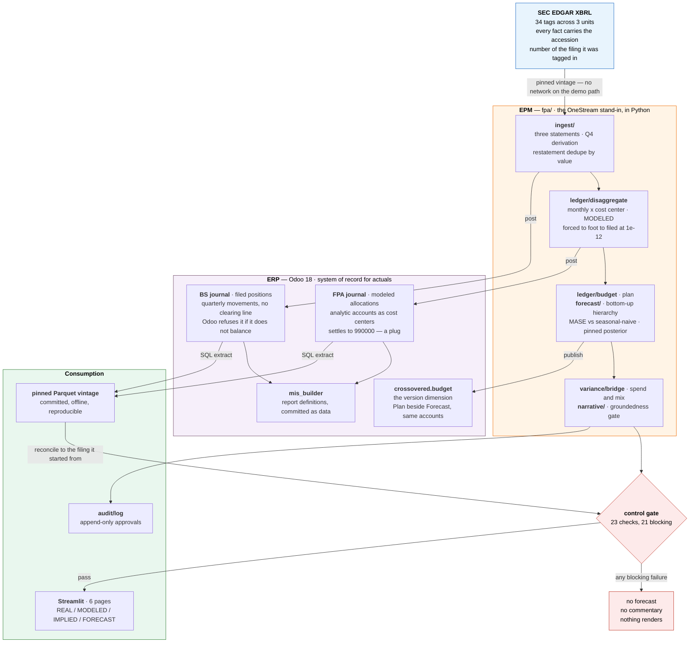

# Auditable FP&A Rolling Forecast

> A bottom-up FP&A rolling forecast built on real SEC filings — where every actual
> traces to the accession number of the document it was tagged in, integrity controls
> block the pipeline rather than warn in a log, and an LLM writes the commentary but is
> structurally incapable of producing a number.

<p align="left">
  <a href="https://auditable-fpa-forecastgit-vxpjph3wlgbr89rvakodg5.streamlit.app/"></a>
  
  
  
  
  
  
  
</p>

A bottom-up hierarchical FP&A forecasting pipeline where **every actual traces to the SEC
filing it came from**, a blocking controls layer gates the pipeline, and the forecast is measured
against a naive benchmark rather than presented on its own.

Actuals come from SEC EDGAR XBRL. All three statements are built and their articulation is
proved before anything reads them. Cost-center detail below the filed lines is modeled and
asserted to foot back. Everything is posted into a real ERP (Odoo) as double-entry journal
entries, extracted back out via SQL, and reconciled to the filing it started from. An LLM
writes the variance commentary and is structurally incapable of producing a number.

```
SEC EDGAR XBRL ──> three statements ──> disaggregation ──> Odoo (posted double-entry)
                          │                                        │
                    articulation                              SQL extract
                     controls                                      │
                          └──────────> control gate <──────────────┘
                                            │
                     ┌──────────────────────┼──────────────────────┐
                 forecast              variance bridge        commentary
              (+ NUTS intervals)      (spend / mix)         (groundedness gate)
```

### Results, measured

| | |
|---|---|
| Ledger foots to filed | **1.31e-16** relative (float64 epsilon) |
| Assets = Liabilities + Equity | **$0.00** across 26 quarters |
| ERP round trip vs filed 10-Q | **$0.02** on $10.4B (cent rounding) |
| ERP balance sheet vs filed | **$0.00** across 17 lines × 26 quarter ends |
| Regions vs filed streaming line | **$0.00** across 3 fiscal years |
| Forecast vs seasonal-naive | MASE **0.936** on filed quarters — beats it by 6%, loses on 4 series |
| Interval calibration | **provisional** — 8 of 9 backtest fits do not converge; see below |
| Groundedness checker | **0% false acceptance, 100% parse coverage** over 364 cases |
| Controls / tests | **23 controls** (21 blocking), **140 tests** |

**Status:** built and verified end to end. `python -m fpa` exits 0 with 21/23 controls passing
and zero blocking failures; the two open items are `WARN` and structural.

---

## Why

Finance teams do not reject AI because the models are weak. They reject it because a number
whose provenance cannot be shown cannot be signed off. This project is built around that
constraint rather than around the model:

- **Provenance over plausibility.** Every filed figure carries the accession number of the
  10-Q or 10-K it was tagged in. Modeled figures are labelled `MODELED`, never mixed in
  silently.
- **Controls that block.** Integrity checks run inside the pipeline on every run, not only in
  CI. A control that only runs in a test suite protects the developer; a control that runs in
  the pipeline protects the number.
- **Accuracy in context.** A forecast is only reported against a seasonal-naive benchmark,
  including the series where the model *loses*.

---

## Capabilities

| Capability | Status |
|---|---|
| SEC EDGAR XBRL ingest with per-fact accession numbers | Built |
| Derived-quarter (Q4) handling with articulation guard | Built |
| Monthly cost-center disaggregation, asserted to foot to filed | Built |
| Three-statement build with articulation controls (balance sheet, cash flow, P&L) | Built |
| Blocking controls layer (23 controls, 21 blocking) | Built |
| Odoo ERP seeding — posted double-entry journals, analytic cost centers, budgets | Built |
| Filed balance sheet posted to the ERP as self-balancing movement entries | Built |
| SQL extract + ERP-to-filing round-trip reconciliation | Built |
| Forecast published to the ERP as a second budget version (Actual / Plan / Forecast) | Built |
| MIS Builder P&L and balance-sheet report definitions, committed as data | Built |
| Regional revenue from SEC Financial Statement Data Sets, with accession trail | Built |
| Bottom-up hierarchical forecast, rolling-origin backtest | Built |
| Posterior-predictive fan in the app (opt-in NUTS fit per cost center) | Built |
| Streamlit UI with provenance badges | Built |
| Budget-vs-actual variance bridge (spend / mix decomposition) | Built |
| Grounded LLM commentary, human-in-the-loop, append-only audit log | Built |
| Measured checker error rates — false acceptance, false rejection, parse coverage | Built |
| Test suite (140 tests) | Built |
| Bayesian posterior-predictive intervals (NumPyro), scored on coverage **and** sharpness | Built (opt-in) |

---

## Evaluation methodology — why these numbers are honest

**The trap.** Backtested on the monthly ledger, ETS scores **MASE 0.632** — comfortably
beating a seasonal-naive benchmark. That number is inflated and should not be quoted. The
monthly grain is filed *quarterly* data that this project disaggregated into months, so part
of the intra-quarter structure a model finds there is structure the disaggregation put there.
A model scores well partly by rediscovering our own allocation weights.

**The honest number.** Re-run on filed quarterly data only — where every value is a figure
Netflix actually reported — the same model scores **MASE 0.936**:

| model | MASE (filed quarterly) | MASE (modeled monthly) |
|---|---|---|
| `ets` | **0.936** | 0.632 |
| `drift_seasonal` | **0.943** | 0.856 |
| `seasonal_naive` | **1.150** | 0.965 |

MASE is scaled by the in-sample seasonal-naive error: below 1.0 beats the benchmark, above
1.0 loses to it. Against filed data the best model beats naive by roughly **6%**, and loses
outright on two of them — `marketing` (1.421) and `operating_income` (1.308). Across both
non-naive models there are four losing (series, model) pairs, and the validation report names
every one.

Both numbers are reported side by side in the app, with the gap named as the artifact.

### Why MASE, and not MAPE

**MASE divides the error by a benchmark computed from the same series** — the in-sample
seasonal-naive error, i.e. how wrong you would have been just saying *"same period last
year."* That makes the number self-interpreting: below 1.0 beats the benchmark, above 1.0
loses to it and you should ship the naive forecast instead. `marketing` at **1.421** means the
model is 42% worse than doing nothing, and nobody has to be told how to read that.

A raw error cannot be judged at all. "Mean absolute error of $180M" is excellent on Content
and catastrophic on Facilities, and comparable across neither.

**MAPE is actively wrong at this granularity.** It divides by the actual, so small
denominators dominate — and the cost centers here span **24×**:

| | mean monthly spend | a $4M miss reads as |
|---|---|---|
| `G&A / Facilities` | $32.1M | 12.5% |
| `Content / Licensed Content` | $780.4M | 0.5% |

Average those and the smallest department outvotes the largest by a factor of 24, despite
mattering 24× less to the business (Phillips, *Pricing and Revenue Optimization* 2e, p.94).
This corrected the build rather than decorating it — the original plan specified MAPE.
Weighted MAPE is reported alongside, which fixes the weighting but still cannot say whether
the model beat anything.

Three properties earn it the headline slot: it is **scale-free**, so nine cost centers across
two orders of magnitude are comparable; it is **defined at zero**, where MAPE divides by zero
on a zero-spend month; and **the benchmark is the denominator**, so a day-1 invariant of this
repo — never publish a metric without its benchmark — cannot be violated by accident.

What MASE does not do is assess an *interval*. That is why the posterior layer is scored on
coverage **and** pinball loss instead: a model predicting ±$10B every month is perfectly
calibrated and perfectly useless (McElreath 2e, p.223).

**And 0.936 is a selected maximum, not an unbiased estimate.** Three models are scored on
the same rolling-origin backtest and the winner is the one quoted. Picking the best from the
evaluation you then publish inflates it — the same reason López de Prado insists a backtest is
for *discarding* models rather than choosing among them (*AFML* p.180).

Two things bound the damage, and one does not. No model was **tuned** on the backtest: the ETS
specification was fixed a priori, and `window_start` was set by an articulation control — a
data-integrity test, not an accuracy one. And with three candidates the selection bias is
small; this is not the thousands-of-simulations case that motivates the deflated Sharpe ratio.
But it is still a maximum over three draws, so **treat 0.936 as the optimistic end of a narrow
range rather than a point estimate.** All three models' scores are printed above precisely so
the selection is visible rather than implied.

**Why operating income is the hardest series.** It is a small difference between two large
numbers, so proportionally modest errors in revenue and cost compound into a large error in
the residual. That is the argument for forecasting the components and letting the margin fall
out — not forecasting the margin directly.

### What "bottom-up" means here, and what it does not

**No exogenous variable enters any model.** Each cost line is extrapolated from its own
history — `seasonal_naive`, `drift_seasonal`, ETS — and parents are formed by aggregation.
There is no regression on subscribers, headcount, instance hours or price.

That is deliberate rather than unfinished, and the reason is worth stating because the
alternative looks available and is not. The pipeline *does* compute a member count and an
ARPU, but members are `MODELED` — invented by this project, since no filer tags membership in
XBRL — and ARPU is `IMPLIED`, solved as revenue ÷ members. Their product reproduces filed
revenue to **$5e-7**. Using them as features would mean regressing revenue on an exact
restatement of itself: zero incremental information, dressed as a driver model.

So what is bottom-up is the **hierarchy**, not the feature set: nine leaves forecast
independently, parents by aggregation, coherent by construction (Nielsen, *Practical Time
Series Analysis*, p.253). And the *principle* is driver-shaped — forecast the components,
never the margin — which the backtest supports rather than assumes, since `operating_income`
is the hardest row in the table.

**The credible route to earning the term** is regional revenue, already ingested and already
`REAL`: UCAN / EMEA / LATAM / APAC are filed, carry accession numbers, and sum to the
consolidated streaming line. Forecasting four filed regions and aggregating is a genuine
driver decomposition on data nobody here invented. That is on the roadmap; it is not built.

---

## What the data actually supports

Findings that shaped the build, each re-proved by a control at runtime rather than
asserted in a comment:

**The series starts in 2020, and that was measured, not chosen.** Q4 is never filed on a
10-Q — companies roll it into the 10-K as a full year — so it must be derived as
FY − (Q1+Q2+Q3). That is only sound if the annual income statement articulates. Netflix's
FY2017–FY2019 annuals do **not** tie against this chart of accounts (off by −$27.3M, +$3.8M
and −$127.9M); FY2020 onward tie to the dollar. The pipeline refuses to derive a quarter from
a year it cannot validate, because the entire discrepancy would land in that one quarter.

**Marketing is recovered from an identity, not estimated.** `MarketingExpense` was last tagged
for the period ending 2024-09-30. After that it is derived as
`Revenue − CostOfRevenue − R&D − G&A − OperatingIncome`. This is exact, not approximate: it
reproduces the filed tag **to the dollar** across all 19 overlap quarters, and the
`marketing_identity` control re-verifies that every run.

**Restatements are counted by value, not by re-reporting.** Every 10-K repeats the prior
year's quarters as comparatives, so counting filings flags ~1,749 of 2,753 facts and trains
everyone to ignore the control. Comparing *values* gives **151 facts that genuinely changed**.

**Not every filed tag is a line on the face of the statement.** Building the balance sheet
needs a *partition* of the filed totals — no gaps, no overlaps. The ASC 842 lease tags look
like balance-sheet lines and are not: they are disclosures nested inside the "other
non-current" captions. Including them double-counted, producing a non-current liability of
**−$571M**, and a negative liability is the only reason the error was visible at all.

Settled empirically rather than by reading the filing, using the adoption step in 2019-Q1
when both tags first appear:

| Caption | Step at adoption | Amount recognised |
|---|---|---|
| `OtherAssetsNoncurrent` | **+$816M** | right-of-use assets $812M |
| `OtherLiabilitiesNoncurrent` | **+$663M** | lease liability $765M |

A caption that jumps by the amount of the thing being adopted contains it. The lease tags
are carried as disclosure columns and excluded from the posting partition.

**Three of Netflix's largest balance-sheet lines cannot be obtained as tags** — content
assets sit under a company extension that `companyfacts` does not expose, treasury stock
stopped being tagged in 2022-03-31 while the buyback programme continued, and content
liabilities are presented but not tagged. Each is derived as a residual of filed figures.
A residual is only honest if it is *named* as the line it represents and checked against
something external, so each one's sign is a blocking control and its magnitude is
sanity-checked: content assets come out at **$33.8B**, Netflix's single largest asset, and
the treasury-stock residual at **−$28.4B** against a decade of disclosed buybacks.

---

## Verification

Current run — `python -m fpa`, exit 0, **21/23 controls passing, 0 blocking failures**:

| Check | Result |
|---|---|
| Ledger foots to filed quarterly figures | 1.31e-16 relative (float64 epsilon) |
| Revenue foots to filed | exact |
| Marketing identity vs filed tag | exact, 19 overlap quarters |
| Income-statement articulation | exact, 26 quarters |
| **Assets = Liabilities + Equity** | **$0.00, 26 quarters** |
| **Detail lines partition the filed totals** | **$0.00 — no gap, no overlap** |
| **CFO + CFI + CFF + FX = ΔCash** | **$0.00, 25 quarters** |
| **Pre-tax − tax = net income** | **$0.00, 26 quarters** |
| Derived residuals hold their sign | 5 lines, every quarter |
| Net income ÷ basic shares = filed EPS | ±$0.005 (filed EPS is rounded to the cent) |
| members × ARPU = revenue | exact |
| **P&L round trip vs filed** | **5.03e-11 relative, $0.02 absolute** |
| **ERP balance sheet vs filed** | **$0.00 across 17 lines × 26 quarter ends** |
| Trial balance, debits vs credits | $0.00, all 7 fiscal years |
| Period completeness | 78 months, 0 gaps |
| Accession coverage | 2,753 / 2,753 facts |
| **Regions sum to the filed streaming line** | **$0.00, 3 fiscal years** |

The two open items are `WARN`, not failures, and both are structural: the first fiscal year
has no budget (year *Y*'s plan is built from year *Y−1* actuals), and 151 genuine restatements
are surfaced for review.

**The round trip is the strongest single result.** Numbers travel EDGAR → disaggregation →
Odoo ORM → posted double-entry journal → analytic distribution → SQL `GROUP BY` → back to the
filed 10-Q, and still tie within **$0.02 on $10.4B**. That two cents is cent-rounding at the
ERP boundary — correct behaviour for a ledger that stores cents, not an error.

**The balance-sheet round trip is harder, and lands exactly.** The P&L posts as independent
monthly entries, so an error stays in its own period. The balance sheet posts as *movements*,
so every quarter's balance is a cumulative sum of every entry before it — one bad entry in
2021 would show up in all twenty quarters that follow. It ties at **$0.00 across all 17 lines
and all 26 quarter ends**.

### Measuring the checker, not just trusting it

The groundedness check is the centerpiece, so "it catches the fabrications we thought of"
is not good enough. `python -m fpa --groundedness` scores it over a generated corpus and
writes `reports/groundedness_evaluation.md`:

| metric | value |
|---|---|
| **False acceptance rate** — a fabrication reaching a reviewer | **0.00%** (0/87) |
| False rejection rate — a valid draft thrown away | 0.00% (0/277) |
| **Parse coverage** — numerals actually inspected | **100%** (364/364) |

**That third metric is the important one, and it exists because of a real bug.** `check()`
reports how many numerals it *matched*, so a verdict only exists for numerals the parser
saw. The regex once ended `(?![\w.])`, which meant `$999.9M.` at the end of a sentence never
matched — a fabricated figure passed not because it was verified but because it was **never
checked**. Accuracy computed over matched numerals would have scored that checker 100% while
it was blind. Silence is the failure mode, so silence gets its own metric: a deliberately
over-inclusive second parser runs alongside, and any span the strict one never covered is
reported. Finding it needs no labels at all.

Labels come from construction rather than annotation — positives composed from payload values
across ten surface forms, negatives mutated one numeral at a time (digit perturbation,
magnitude shift, plausible-but-uncomputed derivation, invented round number).

**And the corpus never consults the checker.** The first version labelled cases using the
checker's own matching rule, which made positives pass and negatives fail by construction —
a perfect score measuring nothing. Labels now come from geometry, with the checker's
tolerance strictly inside a gap it is never allowed to see:

```
|----positive----|      ambiguous      |----negative----|
0            2e-4    MATCH_RTOL 2e-3  2e-2          infinity
```

Four tests then break the checker on purpose — reverting the regex bug, widening the
tolerance, tightening it, dropping scale suffixes — and assert the evaluation goes red.
Without those, "0% false acceptance" is indistinguishable from an instrument that cannot see.

**Still open:** synthetic phrasing is not the distribution a model actually writes. Closing
that needs ~50 real drafts adjudicated by hand — a model writing "roughly six hundred
million" in words would defeat every regex here, and nothing in this corpus would notice.

**A test suite that only passes proves nothing.** A dozen of the 140 tests deliberately corrupt
the data and assert the control catches it — an unbalanced balance sheet, a double-counted
line, a negative content-asset balance, a broken cash roll-forward, a share count misread as
dollars, a double-counted region, a forecast split that no longer ties. One asserts pinball
loss ranks a uselessly wide interval *worse* than a tight one, which is what stops "coverage
and sharpness" being a sentence rather than a property. Same convention throughout: the tests
validate the validators.

---

## Architecture — ERP, EPM, and consumption

Three layers, and the boundaries between them are the design. **Odoo is the ERP** — the system
of record for actuals. **`fpa/` is the EPM** — planning, versioning, variance and reporting
definitions, because Odoo has no forecasting engine and neither does `mis_builder`. **The
Streamlit app is neither**; it renders a pinned snapshot and computes nothing.



Four things in that picture are load-bearing:

- **The round trip.** `fpa/` posts to Odoo and then reads back out through SQL, reconciling to the
  10-Q it started from — **$0.02 on $10.4B** for the P&L, **$0.00** across 17 lines × 26 quarter
  ends for the balance sheet. The ERP is a witness, not a destination.
- **The extract boundary.** Consumption reads the **pinned Parquet vintage**, never live Odoo.
  That is why the app runs with the containers stopped, and why it runs hosted with no database
  at all. It is also how FP&A actually works — nobody runs planning queries against a live
  transactional ERP.
- **The gate sits before consumption, not beside it.** A blocking failure produces no forecast
  and no commentary. Not a warning in a log.
- **The version dimension lives in the ERP; the engine does not.** `crossovered.budget` holds
  Plan beside Forecast against the same accounts, and Actual is never loaded — Odoo derives it
  from the analytic lines.

**What a real EPM has that this does not:** consolidation (single entity, no intercompany
elimination, no FX translation) and a data-entry loop. There is no cell anywhere in this project
you can type a number into — every figure is filed or computed, which is the point, and also the
reason this is a reporting-and-forecasting pipeline rather than a planning tool.

---

## Odoo as the ERP

Companies run FP&A off SAP, Oracle or NetSuite feeding an EPM tool. This project uses
**Odoo 18** (image pinned to `18.0-20260723`) because it is open-source and can actually be
stood up and shown.

Odoo is the **system of record**, not the planning engine. The planning layer — budget,
forecast, variance — lives in Python under `fpa/`. That is not a workaround; ERP feeding EPM
is the real enterprise pattern.

Stock Odoo is an ERP, so the reporting half of EPM comes from **OCA community modules**
(fetched, not written by this project):

| Module | Repo | Purpose |
|---|---|---|
| `mis_builder`, `mis_builder_budget` | OCA/mis-builder | KPI expressions over account balances with budget and variance columns |
| `account_budget_oca` | OCA/account-budgeting | Budgets against analytic accounts |
| `report_xlsx` | OCA/reporting-engine | `mis_builder` dependency |
| `date_range` | OCA/server-ux | `mis_builder` dependency |

The app never queries Odoo live — it reads a pinned Parquet extract, so the demo survives the
ERP being down.

Currently seeded: **78 allocation entries (936 lines)** plus **26 balance-sheet entries**,
debits equal credits to $0.00 for every fiscal year; **858 analytic lines** across **9 cost
centers**; **726 budget lines** under 6 fiscal-year plans.

### Two journals, because they are two different things

| Journal | Holds | Offset |
|---|---|---|
| `FPA` | Cost-center allocation of the filed P&L | `990000 Cost Allocation Offset` |
| `BS` | The filed balance sheet, as quarterly movements | **none — it balances on its own** |

The allocation journal settles against a clearing account in the 9xxxxx range, and that is
what an allocation cycle does in SAP or Oracle: it redistributes cost across cost centers and
settles to a clearing account, because allocation is a management-accounting overlay on the
statutory ledger rather than a second set of books. The balance-sheet report excludes 9xxxxx
by code.

The balance-sheet journal has **no offset account at all**. Because `Assets = Liabilities +
Equity` holds to $0.00 in the filed data, the quarterly movements net to zero and the entry
balances on its own — the debits and credits *are* the filed statement. Treasury stock falls
out correctly with no special case: its filed value is negative and its natural side is
credit, so it lands as a debit balance, which is exactly what contra-equity is.

**And the constraint is demonstrated, not asserted.** This claim spent most of the build as a
docstring saying Odoo *would* reject an unbalanced entry — a "would" in a repository whose
argument is that assertions are not measurements. So it is run:

```bash
.venv/bin/python -m fpa.ledger.odoo_load --prove-rejection
```

```
Unbalanced entry for 2026-06-30: REJECTED
  perturbed: Cash and Cash Equivalents — movement by $1.00
  refused at: create
  Odoo said: <Fault 2: 'The entry is not balanced.'>
```

One dollar on one line out of seventeen, on a $34B balance sheet, and it is refused at
**create** — the entry never becomes a draft, so it never exists in the database at all. The
draft is deleted either way, and the books are verified unchanged afterwards (26 `BS-` and 78
`FPA-` entries, zero `PROOF-`).

That is the whole argument for posting to an ERP rather than reconciling in Python. Every
other control here is one this project wrote, and could be wrong in the same direction as the
code it checks. **This one belongs to an implementation nobody here authored.**

Two caveats worth stating before someone finds them. The constraint is *corroborating*, not
primary — `balance_sheet_balances` already proves `A = L + E` in Python, and Odoo agreeing is
an independent second opinion rather than the only guard. And `seed_balance_sheet` absorbs
sub-dollar cent-rounding into the largest line before posting, so the entry is pre-balanced to
the cent; the movements net to zero *because the filing balances*, and the absorption handles
only the rounding that also produces the $0.02 round-trip figure.

**The allocation journal proves nothing by comparison** — account `990000` absorbs its
residual, and a plug always balances. The budget lines are not validated at all:
`crossovered.budget.lines` has no debit, credit or balance field, so Odoo would accept any
numbers written to it.

### The audit trail crosses into the ERP

Every fact carries the accession number of the filing it was tagged in — but the journal
entry used to carry only `BS-2026-03-31`, a period key. Someone opening the entry in Odoo
could tell which quarter it belonged to and not which document it came from, so validating a
figure against EDGAR meant leaving the ledger. Each entry now carries a provenance block:

```
Filed positions — 2026-03-31
10-Q accession 0001065280-26-000138, filed 2026-04-17
https://www.sec.gov/Archives/edgar/data/1065280/000106528026000138/0001065280-26-000138-index.htm

REAL (12 lines) — read directly from an XBRL tag:
  accounts_payable, accrued_liabilities, aoci, cash, common_stock, deferred_revenue,
  long_term_debt, other_assets_noncurrent, other_liabilities_noncurrent, ppe_net,
  retained_earnings, short_term_investments

IMPLIED (5 lines) — not tagged by the filer; derived as a residual of filed totals,
sign asserted and magnitude checked on every run:
  content_assets, content_liabilities_current, content_liabilities_noncurrent,
  other_current_assets, treasury_stock
```

It goes in `narration`, not `ref`, because `ref` is the idempotency key — changing its
format would re-post the entire history rather than skip it. Existing entries are
backfilled in place.

**The allocation journal gets the opposite block, and that is the point.** It names the same
filing and then denies being it: *"This month is not a filed figure. The filer reports
quarterly, and publishes no cost-center breakdown at all."* A note that cites a 10-Q without
saying so would imply the month came from it. The provenance badges now live inside the
ledger, not only in the Streamlit layer.

**One filing per balance sheet holds only inside the posted window.** All 26 quarter ends
from 2020 trace to a single accession, which is what makes a one-document citation honest.
Before the window, 33 dates draw on up to **three**: `cash` at 2013-03-31 was last restated
in a 10-Q filed July 2014 while its neighbours still come from the original April 2013
filing. A balance sheet *as of* a date is not a balance sheet *as filed in one document*.
The formatter takes a list for that reason, and the test uses the pre-window scatter as its
fixture rather than a mock.

### The scenario dimension — what an EPM tool adds over an ERP

Odoo has no forecasting engine and neither does `mis_builder` — nor should they. What an EPM
tool gives a finance team is the ability to put **Actual, Plan and Forecast** side by side
against the same accounts and cost centers. `crossovered.budget` is a versioned container, so
the Python forecast loads as a second version beside the plan:

| Version | Lines | H2 2026 |
|---|---|---|
| `FY2026 Plan` | 132 | $17.72B |
| `FY2026 Forecast (ets)` | 66 | $18.63B |

Actual is not loaded at all — Odoo derives it from the analytic lines the posted journal
entries generate. The forecast stays authored in Python; the ERP is where it is *published*.

The result is a real planning output. Cloud Infrastructure forecasts **$256M over plan** for
H2 2026, which is the deliberate −14% planning bias on that cost center showing up as a
forecast that has learned from actuals:

| Cost center | Plan | Forecast | Variance |
|---|---|---|---|
| Technology & Product / Cloud Infrastructure | $1,530M | $1,785M | **+$256M** |
| Content / Licensed Content | $7,035M | $6,567M | −$468M |

One subtlety worth naming: the plan published to the ERP is **untrimmed** while the plan used
for variance is not (`build_budget(trim_to_actuals=...)`). Variance must drop plan months with
no actual, or a month that has not happened reports as 100% under budget. The ERP must keep
all twelve, or the rolling forecast has nothing to be compared against.

### Report definitions live in the repo

A report clicked together in the web UI exists in one database. It cannot be reviewed, diffed
or rebuilt, and "why does gross margin say that" is answered with a screenshot. The
`mis_builder` KPI expressions are committed in `fpa/ledger/mis_reports.py` — the same argument
for keeping the SQL in `sql/` as files.

Both reports render inside Odoo and tie to the filing. Operating income comes out at
$4,192,610,000 for Q2 2026, matching the 10-Q to the dollar, and the balance sheet carries the
articulation check as a KPI:

| Income Statement (Q2 2026) | | Balance Sheet | |
|---|---|---|---|
| Revenue | $12.56B | Total assets | $58.45B |
| Gross profit | $6.52B (52%) | Total liabilities | $28.30B |
| Operating income | $4.19B (33%) | Total equity | $30.15B |
| | | **Check: A − L − E** | **0** |

The balance-sheet KPIs are generated from the same `fpa/config.py` tables the loader posts
from, so the report cannot drift from the chart of accounts. Two things the definitions get
right that are easy to get wrong: a margin is accumulated by **average**, not sum (summing a
ratio across twelve months gives a 600% margin, nonsense that looks plausible in a
year-to-date column), and balances use `bale` with **no** accumulation, because a closing
balance is not the total of twelve closing balances.

**The cash-flow statement is deliberately not posted.** No general ledger journalizes a
cash-flow statement — it is derived from the movement in balance-sheet accounts, which is why
a consolidation tool computes it and a transactional system does not. It is built in Python,
reconciled against the filed roll-forward, and reported.

This is a period-end **position load**, the same shape as a consolidation system taking a
trial balance from a subsidiary. It does not attempt to synthesize the transactions behind
the balances, and nothing in the demo claims it does.

---

## The narrative layer — the LLM writes the commentary, never the number

Adopted from this workspace's `energy-batch-trader`, where the LLM may only run the anomaly
gate and never decides a trade: the model is given a job it cannot get wrong in a way that
matters.

Every figure is computed in Python and handed over as a **facts payload**. The model may
describe those figures in prose. Every numeral it returns is then checked back against the
payload — and a draft citing anything else is **rejected**, not flagged. That is
factual-consistency checking (Huyen, *AI Engineering*, pp.219–225), and it is stronger than
RAG in one specific way: the reference is *computed*, not retrieved, so the reference itself
cannot be wrong. A RAG system can faithfully cite a bad document.

Three providers behind one Protocol: `claudecode` (headless `claude -p` — no API key, uses
existing Claude Code auth), `fixture` (deterministic and offline, composed *from* the payload
so it is grounded by construction), and `anthropic` (a documented, deliberately unimplemented
seam — everything around it is already provider-agnostic).

The output is a **draft**. A reviewer approves or rejects; the decision goes to an append-only
audit log with model and prompt version attached. `edited` is a distinct outcome from
`approved` on purpose — a reviewer who rewrites every draft is telling you the drafting does
not work, and collapsing that into "approved" hides exactly the signal worth having.

Three details that make the check work rather than merely look like it works:

- **Relative tolerance.** These are billion-dollar figures; an absolute tolerance means
  `$604.4M` never matches `604,398,923.71` and every draft fails.
- **Scale and percent forms.** Models write `$604.4M` and `22.9%`, not `604398923.71` and
  `0.2292`.
- **Magnitude matching.** The payload holds signed values; prose states magnitude and carries
  direction in words ("a $495.5M reduction"). Requiring the sign would reject correct writing
  as fabrication.

---

## Synthetic layers, and scenario planning

The high-level quarterly figures are authentic SEC data. Public companies do not disclose
internal ledgers or monthly subscriber counts, so four layers are modeled — each
mathematically constrained to sum back to the authentic filed totals:

1. **Intra-quarter phasing** — monthly spend shape within a quarter.
2. **Cost-center allocations** — filed expense lines split to Cloud Infrastructure, Platform
   Engineering, Licensed Content, and so on.
3. **Volume drivers** — member counts. Note only *one* side is invented: members are modeled,
   and **ARPU is then implied** as revenue ÷ members, so their product reproduces filed
   revenue exactly.
4. **Odoo journal entries** — the ERP postings built from layers 1–2.

### What this does and does not support for scenario planning

Because revenue is decomposed into *volume* (members) × *rate* (ARPU), a driver assumption can
be changed and propagated: raise the content-spend growth rate, re-run the bottom-up forecast,
and the leaves re-foot to a new total with operating margin falling out of it. That is
**assumption propagation**, and it is what an FP&A scenario actually is.

It is **not causal**, and the distinction is not cosmetic. Netflix filed one price path, so
there is no variation in this data that identifies how members respond to a price change. A
tool that answers *"the standard tier rises $2 — how much churn?"* is not reading an elasticity
out of the filings; it is asserting a coefficient somebody chose. This pipeline declines to do
that, on the same grounds it declines to fill an EDGAR gap with a vendor figure.

So:

| Question | Supported | Why |
|---|---|---|
| "If content spend grows 15% instead of 8%, what happens to margin?" | **Yes** | Arithmetic on a stated assumption, badged as one; the hierarchy re-foots by construction. |
| "What happens *when we decide* to grow it 15%?" | **No** | Needs a counterfactual — a second, unobserved price/spend path. One realised history does not contain one. |

**Not built.** The scenario *dimension* exists in the ERP: `crossovered.budget` already holds
`FY2026 Plan` and `FY2026 Forecast` against the same accounts, and a driver override would load
as a third version beside them. The override module itself is not written — see the roadmap.

---

## Quickstart

No API keys are required. EDGAR needs only a descriptive User-Agent, and all data is read
from a pinned vintage snapshot, so the demo runs offline.

```bash
python -m venv .venv && .venv/bin/pip install -r requirements.txt

cp .env.example .env          # set EDGAR_USER_AGENT to "Your Name your@email"

.venv/bin/python -m fpa       # ingest -> controls -> forecast; prints the control report
.venv/bin/python -m pytest    # 140 tests
.venv/bin/streamlit run app/Home.py
```

Optional, and deliberately not on the demo path — each fold is a full NUTS fit, so this is
~6 minutes against ~10 seconds for everything else:

```bash
.venv/bin/pip install -r requirements-bayes.txt
.venv/bin/python -m fpa --intervals    # writes reports/interval_calibration.md
```

`--refresh` re-pulls from EDGAR instead of the pinned vintage.

The pinned vintage snapshots are committed (92 KB of Parquet), so a fresh clone runs with
no network call and reproduces every figure in this README byte for byte. `--refresh`
re-pulls from EDGAR. The SEC Financial Statement Data Set archives that `--refresh` reads
for regional revenue are **not** committed — 444 MB of raw ZIPs, and the derived Parquet
is already here.

### Optional: the ERP layer

```bash
./docker/fetch-addons.sh                                    # clone OCA modules (18.0)
docker compose -f docker/docker-compose.yml up -d db
docker compose -f docker/docker-compose.yml run --rm odoo \
    odoo -d fpa_demo -i base,account,account_budget_oca,mis_builder,mis_builder_budget \
    --without-demo=all --stop-after-init
docker compose -f docker/docker-compose.yml up -d odoo

# Seed: chart of accounts, journals, balance sheet, budgets
.venv/bin/python -m fpa.ledger.odoo_load                    # idempotent
.venv/bin/python -m fpa.ledger.forecast_version             # publish the forecast version
.venv/bin/python -m fpa.ledger.mis_reports                  # load the MIS report definitions

# Extract back out — REQUIRED, or four blocking controls have nothing to check
.venv/bin/python -c "
from fpa.config import get_settings
from fpa.extract.odoo_sql import (extract_monthly_actuals, extract_trial_balance,
                                  extract_balance_sheet)
s = get_settings()
for fn in (extract_monthly_actuals, extract_trial_balance, extract_balance_sheet):
    print(fn.__name__, fn(s, refresh=True).shape)"

# Regional segments (~340 MB of SEC archives, cached after the first run)
.venv/bin/python -c "
from fpa.config import get_settings
from fpa.ingest.segments import regional_revenue
print(regional_revenue(get_settings(), refresh=True).shape)"
```

Odoo is then at `localhost:8069` (`admin` / `admin`). The seeder grants its own permission
groups — Odoo 18 gates analytic accounting and budgetary positions behind feature groups.
Use `--reset` on `odoo_load` after any chart-of-accounts change: the seeder matches accounts
by code, so renumbering one leaves historical lines pointing at an account that now means
something else.

**The extract step is not optional if you want the round-trip proof.** Without it,
`erp_extract_reconciles`, `erp_balance_sheet_reconciles`, `trial_balance_nets_to_zero` and
`segment_revenue_foots_to_filed` have no data and **skip**. The pipeline still exits 0,
because it is designed to run without a live ERP — so the report distinguishes *verified*
from *skipped* rather than counting a skip as a pass:

```
## Control report — 17/23 verified, 4 skipped

**4 control(s) did not run:** `erp_extract_reconciles`, … A skip is not a pass.
```

That distinction exists because the first cold-start rehearsal of this quickstart produced
"21/23, zero blocking failures" while the four strongest checks in the project had silently
done nothing.

---

> **Live demo:** **[Open the app ▶](https://auditable-fpa-forecastgit-vxpjph3wlgbr89rvakodg5.streamlit.app/)**
> _(free tier — if it has been idle it may take ~30 s to wake, and the first load runs the
> full pipeline cold)._

### Deploy it (Streamlit Community Cloud)

The repo is deploy-ready: the pinned vintage ships in `data/` (92 KB of Parquet), nothing
imports outside the repository, and `requirements.txt` deliberately excludes NumPyro/JAX so
it installs on a free CPU host.

1. Go to **[share.streamlit.io](https://share.streamlit.io)** and sign in with GitHub.
2. **Create app → Deploy a public app from GitHub**, then set:
   - **Repository:** `godot107/auditable-fpa-forecast`
   - **Branch:** `master`
   - **Main file path:** `app/Home.py`
3. Click **Deploy**. No secrets are required — `EDGAR_USER_AGENT` has a default and is only
   read on `--refresh`, which the hosted app never calls.

It works hosted for the same reason it works with the containers stopped — **the app reads
the materialized extract, never live Odoo.** The committed vintage carries the ERP round-trip
tables alongside the EDGAR facts, so a host that has never seen a database still runs all 23
controls and reports **21 verified, 0 skipped** — the same as a local run with Odoo up. That
is not a demo shortcut; it is how FP&A reporting actually works, and it is why the ERP being
a stand-in costs nothing.

Two things degrade by design rather than break:

| | Hosted behaviour | Why |
|---|---|---|
| Posterior-predictive intervals | **Work fully** — served from pinned draws | The posterior is fitted offline and committed like the data vintage. The app forward-simulates in NumPy, so no sampler and no JAX ever run at read time. |
| `claudecode` narrative provider | Hidden; `fixture` remains | It shells out to the `claude` CLI, which is not on the host. The groundedness gate is provider-agnostic, so the page still demonstrates the rule it exists to demonstrate. |

### The posterior is pinned, not fitted at read time

Sampling inside the app was wrong twice: it could not run on the hosted deploy at all, and
locally it took minutes behind a button labelled "~15s". Neither is a property of the model
— both are a property of doing expensive work at read time.

```bash
.venv/bin/python -m fpa.forecast.posterior   # nine NUTS fits, offline, a few minutes
```

writes `data/posterior_nflx.<vintage>.parquet`. Only the **terminal** level and trend are
stored, plus twelve seasonal offsets and two scale parameters — everything
`simulate_from_state` consumes. The latent path is discarded because the forward simulation
never reads it, which is the difference between ~1 MB and ~30 MB.

Two properties make this safe rather than merely fast:

- **One simulation, two entry points.** A live fit and the cached draws run the same loop
  (`bayes.simulate_from_state`), and a test asserts they return identical arrays. Two copies
  would be free to drift, and the calibration report would stop describing what the app draws.
- **Every series carries a digest of the numbers it was fitted to.** Caching model output is
  the same trap as everything else in this repo: run `--refresh`, the filings move, the draws
  do not, and the resulting fan looks entirely normal. `stale_series` recomputes the digest
  from the live ledger on every read and the page **refuses to plot** on a mismatch. The
  digest covers the period index too, because the same values shifted a month imply different
  seasonal offsets.

R-hat, ESS and divergences are stored alongside the draws and shown on the chart. An
unconverged series is labelled as such on screen rather than quietly plotted — 8 of 9
backtest fits do not converge, and an interval whose diagnostics nobody inspected is not
evidence.

---

## Project layout

```
fpa/
  config.py          Settings, chart of accounts, cost-center hierarchy
  pipeline.py        The only place stages are wired; enforces the control gate
  ingest/edgar.py    SEC EDGAR XBRL; Q4 derivation, restatement dedupe, audit trail
  ingest/statements.py  Three statements, derived lines, articulation
  ingest/segments.py    Regional revenue from SEC Financial Statement Data Sets
  ledger/disaggregate.py  Monthly cost-center split, exact by construction
  ledger/budget.py        The plan; trimmed for variance, untrimmed for the ERP
  ledger/odoo_load.py     Chart of accounts, journals, balance sheet, budgets
  ledger/forecast_version.py  Forecast published to Odoo as a budget version
  ledger/mis_reports.py   MIS Builder KPI definitions, committed as data
  controls/checks.py Control registry with severities and a blocking gate
  forecast/models.py Seasonal-naive benchmark, drift-seasonal, ETS
  forecast/backtest.py    Rolling origin, MASE, two-backtest honesty report
  forecast/bayes.py  NumPyro local linear trend; coverage AND sharpness
  extract/           SQL extract from Odoo -> pinned Parquet snapshot
  variance/bridge.py Budget vs actual, decomposed into spend and mix effects
  narrative/         Facts payload, providers, groundedness check, draft gate
  audit/log.py       Append-only approval log
  kpi/               P&L and balance sheet (filed), process/trust, FinOps (scaffold)
app/                 Streamlit: Overview, Controls, Forecast, Variance, Commentary, Statements
sql/                 Extract queries as first-class artifacts
reports/             Generated calibration report (--intervals)
docker/              Odoo 18 + Postgres, OCA addons, fetch script
tests/               140 tests, including tests that validate the validators
data/                Pinned Parquet vintages (git-ignored, reproducible)
```

**On the test suite.** The most important tests prove the checks *fail* when they should: a
fabricated figure must be rejected, a corrupted ledger must trip the footing control, a missing
month must trip period completeness. A validator that always passes is worse than none — it
certifies nothing while looking like assurance. Writing those tests immediately found three
real bugs, including a regex whose sentence-ending-period handling meant `$999.9M.` was never
checked at all.

**Provenance badges** used throughout the UI: `REAL` (filed, with accession), `MODELED`
(allocated here), `IMPLIED` (forced by an identity), `FORECAST` (model output).

---

## Interval calibration — and why the average hides the answer

The interval layer is a NumPyro **local linear trend with monthly seasonality**, fitted on the
log scale with NUTS. Not a fixed straight line: a fitted slope treats the trend as known
forever, so its intervals grow like √h and understate long-horizon risk. An integrated random
walk lets the slope drift — the band on Cloud Infrastructure widens from **$29M at h=1 to $91M
at h=12**, which is the whole point of quoting an interval over a twelve-month plan.

Every draw continues the random walk from *its own* posterior level, trend and variances, so
the fan carries parameter uncertainty rather than being one fitted path with an error band
bolted on. That distinction is exactly what the deleted Pyro scaffold got wrong, and there is
a test asserting the posterior moves when the data does — the one property a seeded RNG cannot
fake.

**Nominal 80% coverage, rolling origin, 3 folds, 9 cost centers.** ⚠ marks a fit whose
sampler did not converge:

| series | coverage | rel. width | pinball | naive pinball | beats naive? | R-hat | ESS |
|---|---|---|---|---|---|---|---|
| `Content / Licensed Content` ⚠ | 83% | 0.21 | 16,367,634 | 15,913,352 | no | 1.072 | 60 |
| `Content / Original Productions` | 83% | 0.20 | 10,367,675 | 9,731,266 | no | 1.008 | 521 |
| `G&A / Corporate Functions` ⚠ | 78% | 0.44 | 4,311,723 | 4,128,919 | no | 1.011 | 545 |
| `G&A / Facilities` ⚠ | 78% | 0.44 | 1,294,073 | 1,241,430 | no | 1.020 | 272 |
| `Marketing / Brand & Media` ⚠ | 92% | 0.42 | 4,070,333 | 3,836,425 | no | 1.081 | 54 |
| `Marketing / Performance Marketing` ⚠ | 92% | 0.42 | 2,599,119 | 2,181,913 | no | 1.011 | 521 |
| `Technology & Product / CDN & Delivery` ⚠ | 86% | 0.21 | 4,048,956 | 4,133,377 | **yes** | 1.358 | 10 |
| `Technology & Product / Cloud Infrastructure` ⚠ | 92% | 0.22 | 3,775,807 | 4,353,037 | **yes** | 1.991 | 3 |
| `Technology & Product / Platform Engineering` ⚠ | 100% | 0.29 | 2,954,856 | 3,823,185 | **yes** | 1.011 | 1,106 |

**Read the last two columns first, and then read nothing else with much confidence.** Eight of
the nine fits fail R-hat ≤ 1.01 or ESS ≥ 400. The full-data fits mostly converge; the backtest
ones often do not, because rolling origin trains on 42–66 months instead of 78 and a shorter
series identifies the trend and observation scales less well.

The consequence is uncomfortable and worth stating plainly. Two of the three series that
"beat naive" — Cloud Infrastructure at **R-hat 1.99, ESS 3** and CDN & Delivery at **1.358,
ESS 10** — are the least trustworthy rows in the table. **The one fit that did converge,
`Original Productions`, loses to the benchmark.** On the evidence actually available, this
layer has not yet earned its dependency, and saying otherwise would require quoting numbers
the diagnostics say are provisional.

What survives the caveat, because it shows up in the converged and unconverged rows alike:

- **Marketing buys calibration with width.** 92% coverage — *above* nominal — while losing to
  the benchmark on pinball loss. The band is wide, not well-placed. Ranked on coverage alone
  these would be among the best rows here, which is McElreath's forecaster predicting a 40%
  chance of rain every day (*Statistical Rethinking* 2e, p.223).
- **Mean coverage of 87% against a nominal 80% is the least informative number available.**
  It averages a 100% series and a 78% one into a figure that looks like a pass.

**Status: provisional.** The honest next step is more draws for short training windows, or a
simpler model for series under ~60 observations — not a headline claim built on R-hat 1.99.

**The diagnostic that was missing changed everything.** The first version of this layer
reported divergent transitions and nothing else — and ran a **single chain**, which makes
R-hat (a between-chain statistic) impossible to compute at all. Adding three chains and the
two missing diagnostics gave **R-hat 1.93 and ESS 3**, against conventional thresholds of
1.01 and 400. The intervals had been published from a posterior the sampler never explored.

The cause was a non-identified model: it carried both a level shock and observation noise,
which both explain month-to-month variation, so chains settled at `sigma_obs` values spanning
0.012 to 0.025 — a 2× spread in the parameter that sets every interval's width. Dropping the
redundant level shock leaves an identified smooth-trend model.

**And the previous "fix" was making it worse.** `target_accept_prob` had been tuned to 0.99
because that drove divergences toward zero. Measured against all three diagnostics:

| `target_accept` | divergences | R-hat | ESS |
|---|---|---|---|
| 0.80 | 85–142 | 1.010–1.028 | 141–551 |
| 0.90 | 32–189 | 1.007–1.037 | 121–387 |
| 0.95 | 9–87 | 1.006–1.069 | 85–452 |
| **0.99** | **0–38** | **999–1804** | **2** |

At 0.99 the step size collapses and the chains stop moving. Nothing diverges because nothing
is being integrated through. **Optimizing the one diagnostic that was being watched destroyed
the two that were not** — which is this project's own thesis, turned on itself.

**Priors are now simulated, not asserted.** The scale priors carried a comment claiming they
were weakly informative. Simulating the prior predictive — McElreath 2e p.114: *"there is no
other reliable way to understand"* — showed `trend0 ~ N(0, 0.10)` implied a 90% band on
**annual** growth of 0.16× to 6.4×, with draws reaching 127×. That is not weakly informative
for a cost center. At `N(0, 0.02)` the band is 0.58× to 1.68×.

All of this came out of a methodology review against the reference library; see
[`REVIEW.md`](REVIEW.md).

Opt-in, because each fold is a full NUTS fit — ~6 minutes against ~10 seconds for the rest of
the pipeline:

```bash
.venv/bin/pip install -r requirements-bayes.txt
.venv/bin/python -m fpa --intervals        # writes reports/interval_calibration.md
```

---

## Roadmap

**Done.** The three-statement expansion (34 XBRL tags across three units, the filed balance
sheet posted as self-balancing movement entries, nine new articulation controls); the forecast
published to Odoo as a second budget version; MIS Builder report definitions committed as data;
regional revenue ingested from the Financial Statement Data Sets.

**Next.** A driver-override scenario version. Change a growth assumption, propagate it through
the bottom-up hierarchy so the leaves still foot, and load the result into `crossovered.budget`
as a third version beside Plan and Forecast. Deliberately scoped to *assumption propagation* —
the causal version needs an elasticity that one realised price path cannot identify, and
inventing one would undo the provenance discipline the rest of the pipeline is built on.

**Also open.** An independent reconciliation source: pulling the same income statement from a
vendor feed and reporting disagreements as a control finding. Deliberately *not* used to
backfill gaps — a number without a filing behind it cannot be audited, and a documented gap
beats an untraceable value.

### Data and KPI expansion

Additional metrics available from 10-K/10-Q MD&A and shareholder letters:

**Top line and unit economics** — ARM (average revenue per membership) to replace modeled
ARPU with a disclosed figure; regional revenue and FX-neutral growth across UCAN / EMEA /
LATAM / APAC; ad-tier MAUs.

**Operating and profitability** — content amortization versus cash content spend (the gap is
a major cash-burn indicator during production ramps); contribution margin by region.

**Cash flow and capital allocation** — gross and net debt / EBITDA; share-repurchase
execution as a measure of capital-return velocity.

**Engagement proxies** — hours viewed from the twice-yearly *What We Watched* reports, a
leading indicator for churn and LTV; Nielsen streaming share.

Note that several of these are disclosed only in narrative form rather than tagged in XBRL,
so ingesting them means giving up the per-fact accession trail that the filed figures carry —
they would need their own provenance badge.

**Regional segments needed a different SEC product, and it found a business.**
`companyfacts` carries no dimension field — the verified keys are `accn`, `end`, `filed`,
`form`, `fp`, `frame`, `fy`, `start`, `val` — so it only ever exposes the consolidated value
of a tag. Revenue by region lives in SEC's quarterly Financial Statement Data Sets, where
`num.txt` has a `segments` column joined to `sub.txt` on `adsh`. Bulk ZIPs, ~85 MB each,
streamed and filtered. `adsh` *is* the accession number, so the audit trail survives.

Two traps, and the reconciliation control is what surfaced both:

*Netflix tags two overlapping geographic breakdowns.* The four operating regions carry
`ProductOrService=Streaming`; `Geographical=US` is a standalone country disclosure worth
$18.5B in FY2025. Summing everything on the geographic axis inflates revenue ~40% — obvious
in a total, invisible in a per-region chart.

*The regions sum to streaming revenue, not consolidated revenue.* The residual is not an
error, it is the DVD-by-mail business Netflix shut down in September 2023:

| FY2021 | FY2022 | FY2023 | FY2024 | FY2025 |
|---|---|---|---|---|
| $182.3M | $145.7M | $82.8M | **$0.00** | **$0.00** |

A declining tail reaching exactly nil the year after the shutdown. The control tests the tie
against the filed *streaming* line (**$0.00** across the three years it is tagged) and
separately requires the legacy residual to be non-negative and to stay at zero.

**What the regional data does not support.** These are `REAL` figures — filed, and carrying
their accession numbers — but they are *revenue only*. **No cost is allocated to region, and
no regional margin or contribution is claimed anywhere in this project.** That restraint is
deliberate. Subramanyam (*Financial Statement Analysis*, pp.486–487) sets out why segment
profitability is the treacherous part of segment analysis: allocations of common cost across
segments are management judgements rather than measured facts, and they are not comparable
between filers. Netflix reports revenue by region and does not report cost by region, so
region and the modeled cost-center hierarchy are kept as separate dimensions that are never
crossed. Anything else would be inventing a regional cost base and labelling it filed.

---

## License

MIT — see [`LICENSE`](LICENSE).
